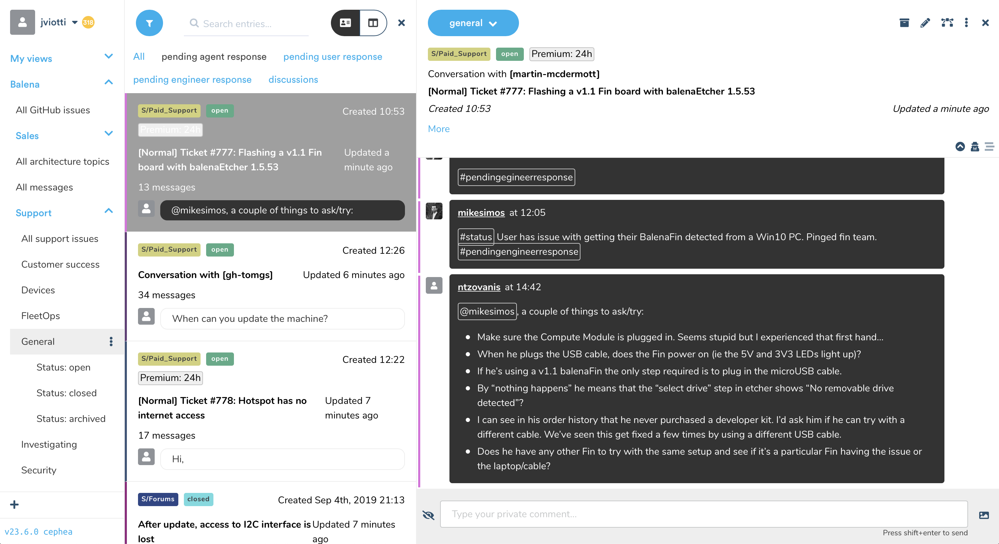

<p align="center">
	
</p>

Jellyfish is a social knowledge database that the team uses to collaborate,
without being blocked by departmental or hierarchal divisions. Jellyfish
gathers all information company wide and makes it a platform to implement
processes that enhance the team's productivity and understanding. Think of it
as a cross between Slack and Excel!

***



***

- **Contributing**
	- [**Architecture overview**](https://github.com/balena-io/jellyfish/blob/master/ARCHITECTURE.md)
	- [**Working with the frontend**](https://github.com/balena-io/jellyfish/blob/master/docs/developing/frontend.markdown)
	- [**Working with the backend**](https://github.com/balena-io/jellyfish/blob/master/docs/developing/backend.markdown)
	- [**Adding a new type**](https://github.com/balena-io/jellyfish/blob/master/docs/developing/add-new-type.markdown)
	- [**Developing locally**](https://github.com/product-os/jellyfish/blob/master/docs/developing/running-on-balena.markdown)
- **Links**
	- [**Rapid7**](https://eu.ops.insight.rapid7.com/op/8306227C3C134F65ACF1#/search?logs=%5B%225df30105-2e0a-4e5a-b76a-baa5fc997b36%22%5D&range=Last%2020%20Minutes)
	- [**Sentry**](https://sentry.io/organizations/balena/issues/?project=1366139)
	- [**New Relic**](https://synthetics.newrelic.com/accounts/2054842/monitors/8bf2b38d-7c2a-4d71-9629-7cbf05b6bd21)
- **Services**
	- [**Using New Relic**](https://github.com/product-os/jellyfish/blob/master/docs/newrelic.markdown)
	- [**Using Balena CI**](https://github.com/product-os/jellyfish/blob/master/docs/balenaci.markdown)
	- [**Using Sentry**](https://github.com/product-os/jellyfish/blob/master/docs/sentry.markdown)

***

- [Development Environment](#development-environment)
	- [Docker Compose](#docker-compose)
	- [Running natively](#running-natively)
		- [tmuxinator](#tmuxinator)
	- [Developing on Balena](#developing-on-the-nuc-job)
- [Testing](#testing)
- [Committing](#committing)
- [Reporting problems](#reporting-problems)
- [License](#license)

# Development Environment
There are two main ways of running Jellyfish. Either with Docker Compose, which matches the production environment closely or Natively with the `Make` commands. Running it Natively is less intensive so most developers use this approach.

## Docker Compose
This is the easiest way to run Jellyfish locally given you have [Docker
Compose](https://docs.docker.com/compose/) installed. First build all the
containers:

```sh
npm install
make compose-build
```

Run them with:

```sh
make compose-up
```

Add endpoints to local hosts file:

```
127.0.0.1 livechat.ly.fish.local api.ly.fish.local jel.ly.fish.local
```

The API will listen on `http://api.ly.fish.local:80` and the UI will listen on `http://jel.ly.fish.local:80`.
Open `http://jel.ly.fish.local` and login as:

- Username: `jellyfish`
- Password: `jellyfish`

## Running natively
If you want to run Jellyfish natively, the pre-requisites are:

- Redis (`brew install redis` on macOS)
- PostgreSQL (`brew install postgresql` on macOS)
- Node.js
- Python 2

Install the dependencies:

```sh
npm install
```

You can then run these commands in different terminal emulators, which will run
all services in non-daemon mode:

```sh
make start-postgres
make start-redis
make start-server
make start-tick
make start-worker # Run more than once for more workers
make build-ui start-static-ui
```

The API will listen on `8000` and the UI will listen on `9000`. Open
http://localhost:9000 and login as:

- Username: `jellyfish`
- Password: `jellyfish`

> Note: The development user is not available in production
> (`NODE_ENV=production`)

### [tmuxinator](https://github.com/tmuxinator/tmuxinator)
> Manage complex tmux sessions easily
Running Jellyfish natively requires you to start atleat 5 processes. tmux and tmuxinator make it easier to start these processes all at once

```yaml
# /Users/work/.config/tmuxinator/jellyfish.yml

name: jellyfish
root: ~/Code/jellyfish

windows:
  - jellyfish:
      layout: tiled
      panes:
        - make start-postgres
        - make start-redis
        - make start-server
        - make start-tick
        - make start-worker # Run more than once for more workers
        - make dev-ui start-static-ui COVERAGE=0
```
Combined with the following aliases
```bash
alias mux=tmuxinator
alias jstart="tmuxinator jellyfish"
alias jstop="tmuxinator stop jellyfish"
alias jrs="tmuxinator stop jellyfish && mux jellyfish"
```

## Developing on the NUC (JoB)
> for back end services, you can use the CLI to "balena push" to the device while it is in local mode (this is standard balenacloud) dev practise). The story for developing with webpack builds is no 100% yet, but for our purposes you can simply build the UI locally and point it at the api address on the NUC
@lucianbuzzo

Step-by-Step is a work in progress.


# Testing

>Note: the `make lint` script has a dependency on [shellcheck](https://github.com/koalaman/shellcheck) which must
>be installed first.

You can run the linter like this:

```sh
make lint
make lint FIX=1 # Optionally try to fix some of the linting issues
```

The tests live in `test/<type>/<component>/**/*.spec.js`, where `type` is
`unit`, `integration`, or `e2e` and `component` corresponds to any of the
directories inside `lib` or `apps`. As an exception to the rule, the frontend
components store their unit tests along with the production code (company
policy).

We provide GNU Make utility rules to run different test suites, for example:

```sh
make test-integration-queue                      # Run all the queue integration tests
make test-e2e-server                             # Run all the server end to end tests
make test-e2e                                    # Run all the end to end tests
make test FILES=./test/unit/worker/utils.spec.js # Run a specific unit test file inside "worker"
```

Some suites may provide or require various options. Consult the corresponding
["Developing"
guides](https://github.com/balena-io/jellyfish/tree/master/docs/developing) or
the [`Makefile`](https://github.com/balena-io/jellyfish/blob/master/Makefile)
if unsure.

For testing and debugging the backend also have a ook at: [**Working with the backend**](https://github.com/product-os/jellyfish/blob/master/docs/developing/backend.markdown)

# Committing

Commits must follow Balena commit rules: they must include a `Change-type: (patch|minor|major)`, they can include a `Connects-to: #1234`, they can be signed off.
To ease this, the following script is provided
```bash
#!/usr/bin/env bash

set -e

if [[ $# == 0 ]]; then
    echo -e "Usage:\n\n\tgit balena-commit [ISSUE NUMBER,ISSUE NUMBER...] [CHANGE TYPE] [COMMIT ARGS...]\n"
    exit 1
fi

issues=()
while [[ "$1" =~ [0-9]+ ]]; do
    issues+=("$1")
    shift
done
change_type=
if [[ "$1" =~ major|minor|patch ]]; then
    change_type=$1
    shift
fi
git commit "$@"
for issue in "${issues[@]}"; do
    GIT_EDITOR="git interpret-trailers --trailer \"Connects-to: #${issue}\" --in-place" git commit --amend --no-verify --quiet
done
test -n "${change_type}" && GIT_EDITOR="git interpret-trailers --trailer \"Change-type: ${change_type}\" --in-place" git commit --amend --no-verify --quiet
git commit --amend --no-edit --signoff --no-verify --quiet
```

Save it somewhere in your `PATH` as `git-balena-commit`, and make it executable.

Typing `git balena-commit` will print how to use it

# Reporting problems

If you're having any problem, please [raise an
issue](https://github.com/balena-io/jellyfish/issues/new) on GitHub and the
Jellyfish team will be happy to help.

# License

Jellyfish is propietary software. Unauthorized distribution of any files in
this repository via any medium is strictly prohibited.
