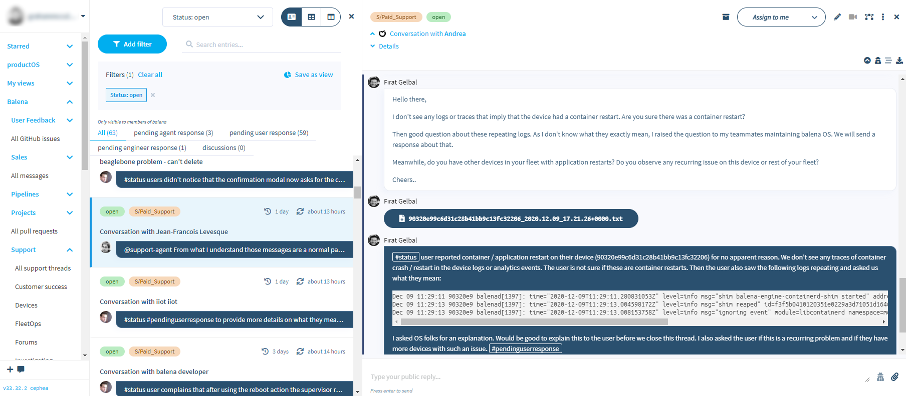

<p align="center">
	
</p>

Jellyfish is a social knowledge database that the team uses to collaborate,
without being blocked by departmental or hierarchal divisions. Jellyfish
gathers all information company wide and makes it a platform to implement
processes that enhance the team's productivity and understanding. Think of it
as a cross between Slack and Excel!

A "living specification" for the intended functioning of Jellyfish can be found [here](https://docs.google.com/document/d/1psa9upjr__LDbF0442ndW72Nj8jAuA48mmqPdahQBUs/edit?usp=sharing).
Many parts of Jellyfish are still under development, and this document aims to create a source of truth for how the platform *should* work, even if it doesn't represent the current functionality.

***



***

- **Contributing**
	- [**Design manifesto**](https://github.com/product-os/jellyfish/blob/master/docs/design-manifesto.markdown)
	- [**Architecture overview**](https://github.com/product-os/jellyfish/blob/master/ARCHITECTURE.md)
	- [**JellyFish Core**](https://github.com/product-os/jellyfish-core/blob/master/README.md) the low-level internal SDK to interact with cards and links in the database
	- [**Plugin development**](https://github.com/product-os/jellyfish/blob/master/docs/developing/plugins.markdown)
	- [**Working with the frontend**](https://github.com/product-os/jellyfish/blob/master/docs/developing/frontend.markdown)
	- [**Working with the backend**](https://github.com/product-os/jellyfish/blob/master/docs/developing/backend.markdown)
	- [**Adding a new type**](https://github.com/product-os/jellyfish/blob/master/docs/developing/add-new-type.markdown)
	- [**Developing locally**](https://github.com/product-os/jellyfish/blob/master/docs/developing/local-development.markdown)
	- [**Running in compose**](https://github.com/product-os/jellyfish/blob/master/docs/developing/running-in-compose.markdown)
	- [**Running tests in compose**](https://github.com/product-os/jellyfish/blob/master/docs/developing/running-tests-in-compose.markdown)
	- [**Adding metrics**](https://github.com/product-os/jellyfish-metrics/blob/master/doc/adding-metrics.markdown)
	- [**Writing translate tests**](https://github.com/product-os/jellyfish-test-harness/blob/master/doc/writing-translate-tests.markdown)
- **Links**
	- [**Rapid7**](https://eu.ops.insight.rapid7.com/op/8306227C3C134F65ACF1#/search?logs=%5B%225df30105-2e0a-4e5a-b76a-baa5fc997b36%22%5D&range=Last%2020%20Minutes)
	- [**Sentry**](https://sentry.io/organizations/balena/issues/?project=1366139)
	- [**New Relic**](https://synthetics.newrelic.com/accounts/2054842/monitors/8bf2b38d-7c2a-4d71-9629-7cbf05b6bd21)
	- [**Metrics**](https://monitor.balena-cloud.com/dashboards/f/auto/auto)
- **Services**
	- [**Using New Relic**](https://github.com/product-os/jellyfish/blob/master/docs/newrelic.markdown)
	- [**Using Balena CI**](https://github.com/product-os/jellyfish/blob/master/docs/balenaci.markdown)
	- [**Using Sentry**](https://github.com/product-os/jellyfish/blob/master/docs/sentry.markdown)
- **Integrations**
	- [**Integrating with GitHub**](https://github.com/product-os/jellyfish/blob/master/docs/integrating-github.markdown)

Installing dependencies
-----------------------

```sh
$ npm i
```

Developing with Livepush
------------------------

To start developing, you must first install [balenaCLI](https://github.com/balena-io/balena-cli) and set up a local-mode device.

### Prepare the device
1. Create a new balenaCloud app as described [here](https://www.balena.io/docs/learn/getting-started/intel-nuc/nodejs/)
2. After your device shows up in the dashboard, enable [local mode](https://www.balena.io/docs/learn/develop/local-mode/)

### Deploy code
Now that the device is up and running in local mode, we need to get its local IP address:
```
$ sudo balena scan | grep address
  address:       <DEVICE-IP-ADDRESS>
```

Add endpoints to local hosts file:
```
<DEVICE-IP-ADDRESS> livechat.ly.fish.local api.ly.fish.local jel.ly.fish.local postgres.ly.fish.local redis.ly.fish.local
```

If you are going to be working with any libraries, clone them under `.libs` and checkout your branches.

Finally, deploy everything to the device by executing `make push` from the repository root.

Once deployed, app and library source changes will cause quick service reloads. Adding and removing
app dependencies will cause that service's image to be rebuilt from its `npm ci` layer. Adding and
removing library dependencies is a bit different. The following is an example when working with the
`jellyfish-worker` library:

```sh
$ cd .libs/jellyfish-worker
$ npm install new-dependency
$ cd ../..
$ npm run push:lib jellyfish-worker
```

What this does is create a local beta package for `.libs/jellyfish-worker` using `npm pack` and then
copies the resulting tarball into apps `packages` subdirectories. This triggers partial image rebuilds.

### Connecting to Postgres and Redis
The Postgres and Redis services running on the Livepush device can be accessed with:
```
$ psql -hpostgres.ly.fish.local -Udocker jellyfish -W (password = docker)
$ redis-cli -h redis.ly.fish.local
```

### Resetting
Deleting cloned libraries from `.libs/` or deleting library tarballs from `apps/*/packages/` doesn't currently
reset that library to it's original state in the app(s) on your Livepush device. This can lead to a confusing
state in which your local source doesn't correctly mirror what's being executed on your device. To reset your
device back to a clean state:
- `rm -fr .libs/*` (Assuming you no longer need these libraries)
- `make push NOCACHE=1`

The `NOCACHE` option sets the `--nocache` flag for `balena push`: [balena CLI Documentation](https://www.balena.io/docs/reference/balena-cli/#-c---nocache)

### Troubleshooting
- Tail individual service logs with `balena logs jel.ly.fish.local --service <name>`
- Log into device with `balena ssh`, which allows you to then:
	- Check running containers with `balena ps`
	- Enter running container with `balena exec -ti <name> bash`
	- Check container logs directly from within device using `balena logs <name>`

### Debugging
When using live push the API and action servers start with remote debugging enabled via the `--inspect` flag. Use Chrome dev tools, or your IDE to [start a debugging session](https://nodejs.org/en/docs/guides/debugging-getting-started/#inspector-clients).

- To debug API server connect to `<DEVICE-IP-ADDRESS>:9229`
- To debug the worker server connect to `<DEVICE-IP-ADDRESS>:923<WORKER-ID>`
	- e.g. to connect to the first worker `<DEVICE-IP-ADDRESS>:9231`

Testing
-------

You can run the linter like this:

```sh
$ npm run lint
```

The tests live in `test/<type>/**/*.spec.js` and `apps/server/test/<type>/**/*.spec.js`.
Frontend components store their unit tests along with the production code (company policy).

We provide GNU Make utility rules to run different test suites, for example:

```sh
$ make test-e2e-server                             # Run all the server end to end tests
$ make test FILES=./test/e2e/sdk/card.spec.js      # Run a specific test file
```

Some suites may provide or require various options. Consult the corresponding
["Developing"
guides](https://github.com/product-os/jellyfish/tree/master/docs/developing) or
the [`Makefile`](https://github.com/product-os/jellyfish/blob/master/Makefile)
if unsure.

Reporting problems
------------------

If you're having any problem, please [raise an
issue](https://github.com/product-os/jellyfish/issues/new) on GitHub and the
Jellyfish team will be happy to help.

License
-------

Jellyfish is propietary software. Unauthorized distribution of any files in
this repository via any medium is strictly prohibited.
