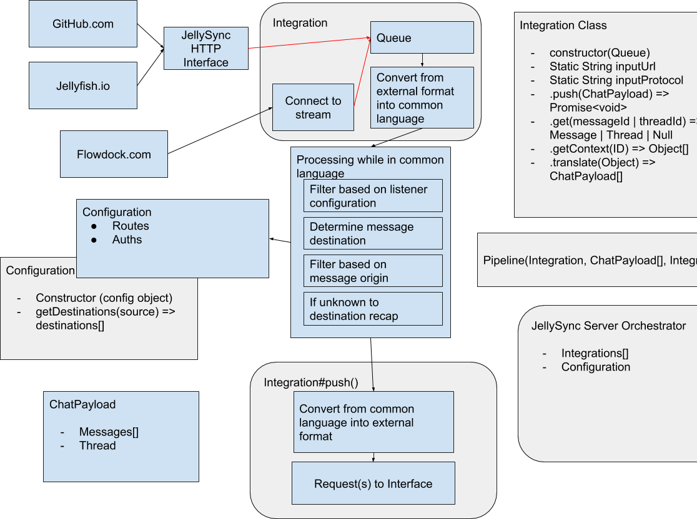

JellySync Tech Brief
==

A quick description of how a re-imagined SyncBot would work after the deprecation of ProcBots and with the upcoming 
Jellyfish data engine.

Moving Parts
--

1. Some external services
	* These must create entities which we may want to have a threaded conversation about
	* These might support threaded conversation
	* These might support a distinction of audience visibility
	* These must manage their own state, ids and data persistence
	* These must turn any streaming, state scraping or pidgeons into a webhook emit
2. Some inbound translation routes
	* These must be stateless
	* Should trigger from card created by the service when it sends a payload to `/api/v2/hooks/:provider`
	* *Translate* the payload from the external service format into Jellyfish
3. One Jellyfish storage server
	* The `message` card should have subtypes `reply`, `whisper` and `system-message`.
	* An `author` card might need to exist, should have an inheritance relationship with `user`
	* `thread`, `author` and `message` cards should support an `externalIds` array
4. Some outbound translation routes
	* These must be stateless
	* Should trigger from card that is itself of interest, or its head is of interest
	* *Translate* the payload from jellyfish format into the external service

Translation
--

1. Ensure that we have *source* *flow* details
1. Find places that this *head* already exists, from the *hub*
1. If the *target* doesn't know about the *head*
	1. Check whether this route is meant to be syncing *head*
	1. Request a recap from *source*
1. Find places that the *events* already exist, from the *hub*
1. Remove from the payload any *events* that already exist on *target*
1. Push this *timeline* to the *target*

Configuration
--

* The configuration must contain details of how to connect to each instance of each service
* The configuration must contain details of the routes threads should follow
* The configuration should be git-backed with injected secrets
* The configuration could contain translations of error messages
* The configuration could contain thread-management commands (eg `#close`)
* The configuration could contain JellySync management details (eg `@JellySync, process.uptime?`)

Quick Sketch
--

